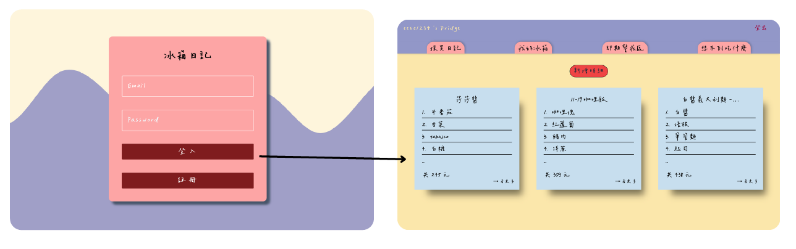
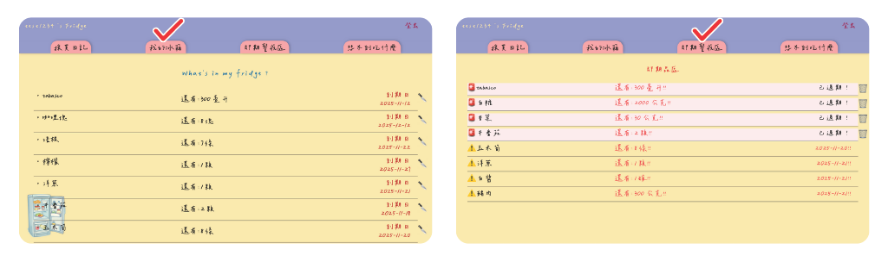
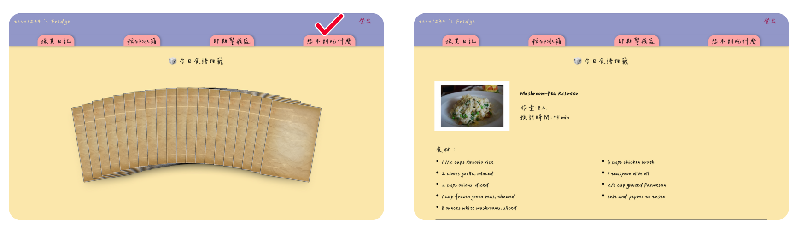

# FridgeDiary



<br>
冰箱管理高手！可以追蹤庫存、提醒期限，守護被忘記的食材！

---

## 目錄

- [專案發想 Project Idea](#專案發想-project-idea)
- [功能 Features](#功能-features)
- [技術棧 Tech Stack](#技術棧-tech-stack)
- [專案架構 Project Structure](#專案架構-project-structure)
- [開發工具與部署 Development Tools and Deployment](#開發工具與部署-development-tools-and-deployment)
- [頁面使用說明 Page Guide](#頁面使用說明-page-guide)
- [計劃未來會實現 Planned feature](#計劃未來會實現-planned-feature)


## 專案發想 Project Idea

我喜歡煮飯，但經常有一些困擾。
例如，打開冰箱時，常常忘記裡面到底還有哪些食材；
要開始做菜時才發現某樣食材已經過期或只剩一點，
甚至煮到一半才發現某個材料根本沒有了。

所以我想打造一個能追蹤庫存、提醒食材期限、並每天提供食譜靈感的系統，
讓自己每天煮飯買菜時都能更輕鬆，也更不會浪費食材。

## 功能 Features

- 使用者登入 / 註冊 
- 購買清單紀錄
- 食材新增、編輯、刪除
- 食材庫存、使用刪減
- 判斷食材是否進入「即期區」
- RWD（響應式設計），適用手機與桌面
- user狀態管理使用 Pinia
- 每日自動抓取食譜(AI協助自架後端自動更新，部署於 Vercel）


## 技術棧 Tech Stack

**前端**
- **Vue 3** 
  <br>
        採用現代化的 JavaScript 框架，支援組件化開發與響應式資料綁定。
- **Tailwind CSS** 
    <br>
        快速排版，搭配元件拆分與路由規劃。
- **Toast / 提示訊息**
    <br>
        使用Vue Toastification顯示輕量提示訊息元件，提醒使用者操作結果，例如註冊成功或失敗信息。
- **Vue Router** 
    <br>
        負責前端頁面導覽，支援巢狀路由與動態路由功能，實現單頁應用的多視圖切換。
- **Pinia** 
   <br>
       使用Pinia狀態管理，包含使用者登入登出狀態、初始信箱驗證。

- **Lazy Loading 懶加載** 
    <br>
       定義路由時使用懶加載的技術，當使用者需要時才動態加載組件，減少初次加載所需時間 。
- **無限滾動** 
    <br>
        一次載入限制為6篇購物清單，向下滾動到一定的高度時觸發載入更多資料， 避免一次載入過多資料造成效能負擔。

**後端**
- **Firebase** 
    <br>
        使用 Firebase 提供的Firestore 做為後端資料庫，儲存文章內容、留言與使用者資料;
        透過Authentication實作會員登入、註冊系統、驗證信箱等功能。
- **每日自動抓取食譜** (AI協助自架後端自動更新，部署於 Vercel）

    使用 Node.js 撰寫後端程式，每天自動向Spoonacular API抓取20篇隨機食譜，並更新至Firebase Firestore。  
        部署於Vercel，確保前端每日都能取得最新食譜並存入firestore裡。

  
## 開發工具與部署 Development Tools and Deployment
- **Vite**
  <br>
  使用Vue搭配Vite快速建置專案，提供即時模組熱重載與高效能打包能力。
  <br>
- **Vercel**部署 
 前端專案直接部署於 Vercel。  
 後端 Node.js serverless function 也部署於 Vercel，負責每日自動抓取食譜。  


## 專案架構 Project Structure


```text
FridgeDiary/
  cookbook-backend/                  
    dailyRecipe.js          # 每天自動抓 20 篇食譜，更新 Firebase
  src/
    assets/                 # 圖片、樣式
    components/             # Vue文件
    firebase/               # Firebase 設定檔
    router/                 # Vue Router 路由設定
    stores/                 # Pinia狀態管理
    views/                  # 各頁面的view
  README.md
  
```

---
## 頁面使用說明 Page Guide

- 冰箱庫存（左圖）：
清楚看出所剩的食材數量。若以使用食材，可以透過點擊🔪扣除數量，維持最新的庫存狀態。

- 即期警戒區（右圖）：
分為過期區及即期區兩區
- 過期區：以紅燈閃爍標示，提醒立即需要處理，可直接刪除。
- 即期區：以黃色圖案標示，即將到期提醒優先使用。



- 每日隨機食譜  
  每日限抽一次隨機食譜，提供料理靈感！

**測試帳號**  
**帳號** : vera.sampletest@gmail.com  
**密碼** : 12341234  

此帳號僅供測試！歡迎自行註冊帳號體驗！

## 計劃未來會實現 Planned feature

- **家庭共用功能**  
  未來將開發多人共用的管理功能，可以共用冰箱查看庫存、即期區提醒，方便全家購物與食材管理。

- **個人食譜紀錄**  
  提供使用者記錄自己的食譜與烹飪心得，並可與每日抓取的食譜結合，建立個人化食譜收藏與管理系統。
